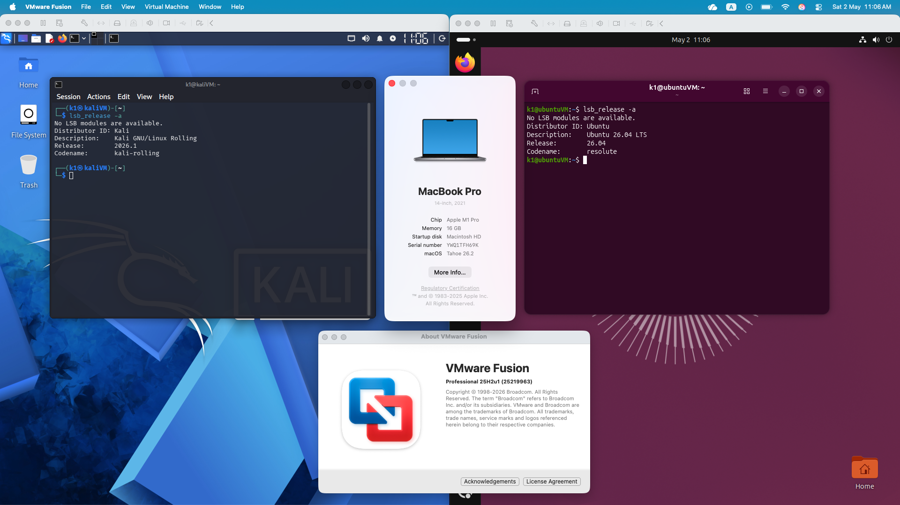
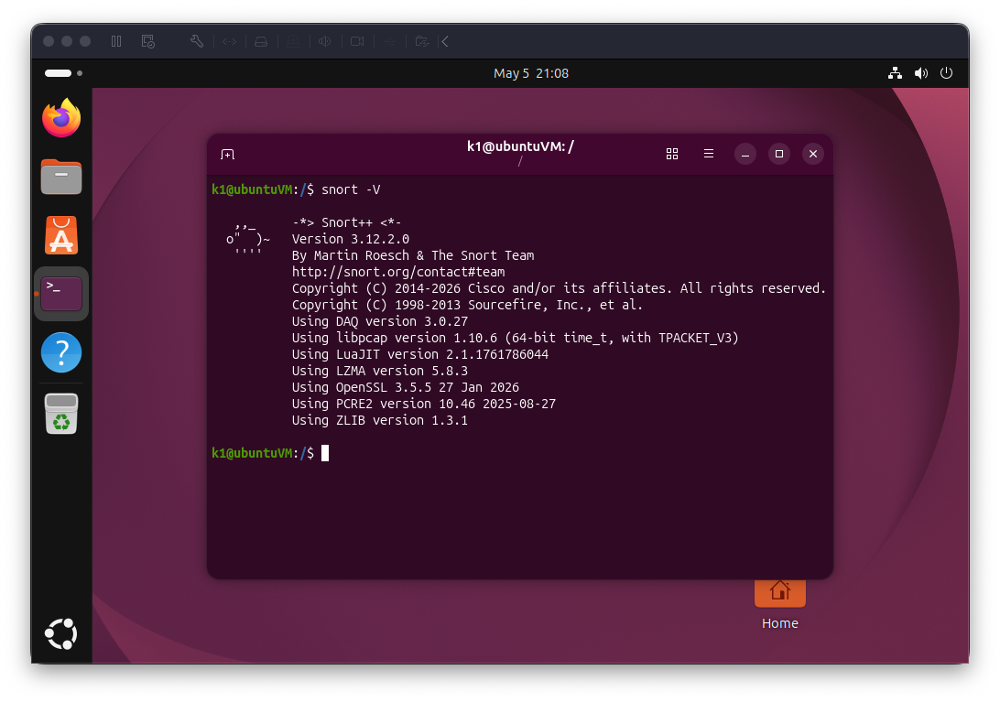
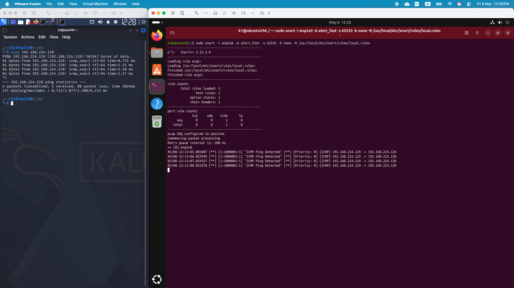

# snort-ids-lab-vmware

Practical Snort 3 IDS lab demonstrating installation, rule writing, packet analysis, and intrusion detection in a controlled virtual environment. Built as a hands-on portfolio project.

---

## 📋 Table of Contents

- [Objectives](#-objectives)
- [Lab Environment](#️-lab-environment)
- [Lab Architecture](#-lab-architecture)
- [Network Configuration](#-network-configuration)
- [Installation](#-installation)
- [Running Snort in IDS Mode](#-running-snort-in-ids-mode)
- [Attack Scenarios](#️-attack-scenarios)
- [Lessons Learned](#-lessons-learned)
- [Roadmap](#️-roadmap)

---

## 🎯 Objectives

- Deploy Snort 3 as a Network Intrusion Detection System (NIDS) on Ubuntu
- Write and tune custom Snort 3 rules to detect real attack patterns
- Simulate attacks from Kali Linux and validate detection accuracy

---

## 🖥️ Lab Environment

### Hardware

- Apple MacBook Pro (2021)
- Apple M1 Pro Chip
- 16 GB RAM

### Virtualization Platform

- VMware Fusion 25H2U1

### Virtual Machines

#### 🔴 Attacker Machine

- OS: Kali Linux 2026.1
- Interface: `eth0`
- IP: `192.168.224.129`
- Role: Attack simulation (scanning, probing, traffic generation)

#### 🟢 Victim / Detection Machine

- OS: Ubuntu 26.04 LTS (Resolute)
- Interface: `enp2s0`
- IP: `192.168.224.128`
- Snort Version: **3.12.2.0**
- Role: Snort IDS (Intrusion Detection System)

---

## 🧠 Lab Architecture

```
┌─────────────────────────┐     Isolated VMware Host-Only Network      ┌──────────────────────────┐
│   🔴 Kali Linux          │ ──────────────────────────────────────────► │   🟢 Ubuntu 26.04        │
│   192.168.224.129        │          Attack traffic                     │   192.168.224.128        │
│   Attacker               │ ◄────────────────────────────────────────── │   Snort 3.12.2.0 IDS     │
│   nmap · hping3          │          Snort alerts                       │   Monitors all traffic   │
└─────────────────────────┘                                             └──────────────────────────┘
```

Both machines are on the same `/24` subnet within an isolated VMware Fusion host-only network with no external internet exposure.



---

## 🌐 Network Configuration

Before running Snort, the Ubuntu network interface must be set to promiscuous mode so Snort can capture all traffic on the segment, not just traffic addressed to itself.

```bash
sudo ip link set enp2s0 promisc on
```

Verify promiscuous mode is active:

```bash
ip link show enp2s0
```

Expected output includes `PROMISC` in the flags:

```
2: enp2s0: <BROADCAST,MULTICAST,PROMISC,UP,LOWER_UP> mtu 1500 ...
```

> ⚠️ **VMware Fusion note:** Enabling promiscuous mode on a VM triggers a macOS security prompt asking for the host machine's administrator password. This is expected — VMware requires host-level permission to allow the VM to monitor all network traffic.

---

## 🔧 Installation

> ⚠️ **Note for Ubuntu 26.04 users:** Most online guides target Ubuntu 22.04. The package names below have been updated and verified for Ubuntu 26.04 (Resolute).

### Step 1 — Update the system

```bash
sudo apt update && sudo apt upgrade -y
```

### Step 2 — Install prerequisites

```bash
sudo apt install -y \
  build-essential g++ gcc cmake \
  libpcap-dev libpcre2-dev \
  zlib1g-dev liblzma-dev \
  libluajit-5.1-dev libhwloc-dev \
  libdumbnet-dev bison flex \
  openssl libssl-dev libnghttp2-dev \
  autoconf automake libtool pkg-config \
  libunwind-dev libfl-dev \
  libgoogle-perftools-dev
```

> 💡 **Ubuntu 26.04 fix:** `libpcre3-dev` is no longer available — use `libpcre2-dev` instead. `libdnet-dev` is also removed; `libdumbnet-dev` covers it.

### Step 3 — Install LibDAQ from source

Snort 3 requires LibDAQ (Data Acquisition library), which is not available via apt:

```bash
cd /tmp
git clone https://github.com/snort3/libdaq.git
cd libdaq
./bootstrap
./configure
make
sudo make install
sudo ldconfig
```

### Step 4 — Install Snort 3 from source

```bash
cd /tmp
git clone https://github.com/snort3/snort3.git
cd snort3
./configure_cmake.sh --prefix=/usr/local --enable-tcmalloc
cd build
make -j$(nproc)
sudo make install
sudo ldconfig
```

### Step 5 — Verify installation

```bash
snort -V
```

Expected output:
```
   ,,_     -*> Snort++ <*-
  o"  )~   Version 3.12.2.0
   ''''  
```

Snort successfully validated the configuration (with 0 warnings).



---

## 🚀 Running Snort in IDS Mode

### Step 1 — Create the rules file

```bash
sudo mkdir -p /usr/local/etc/snort/rules
sudo nano /usr/local/etc/snort/rules/local.rules
```

Add your rules, save with `Ctrl+O` → Enter → `Ctrl+X`.

### Step 2 — Run Snort

```bash
sudo snort -i enp2s0 -A alert_fast -s 65535 -k none \
-R /usr/local/etc/snort/rules/local.rules
```

**Flag explanation:**

| Flag | Meaning |
|------|---------|
| `-i enp2s0` | Listen on this network interface |
| `-A alert_fast` | Print alerts to terminal in fast format |
| `-s 65535` | Snaplen — capture full packets |
| `-k none` | Ignore checksum errors (common in VMs) |
| `-R` | Load custom rules file |

> 💡 In Snort 3.12.2.0, `-A alert_fast` prints alerts directly to the terminal — no log directory flag required for basic IDS monitoring.

---

## ⚔️ Attack Scenarios

| # | Attack Type | Tool | Snort Rule SID | Detected |
|---|-------------|------|----------------|----------|
| 1 | ICMP Ping Sweep | ping | 1000001 | ✅ |

### Scenario 1 — ICMP Ping Detection ✅

**Attack (from Kali):**
```bash
ping 192.168.224.128
```

**Snort alert output:**
```
05/08-12:13:05.003407 [**] [1:1000001:1] "ICMP Ping Detected" [**] [Priority: 0] {ICMP} 192.168.224.129 -> 192.168.224.128
05/08-12:13:06.025939 [**] [1:1000001:1] "ICMP Ping Detected" [**] [Priority: 0] {ICMP} 192.168.224.129 -> 192.168.224.128
05/08-12:13:07.029527 [**] [1:1000001:1] "ICMP Ping Detected" [**] [Priority: 0] {ICMP} 192.168.224.129 -> 192.168.224.128
05/08-12:13:08.033378 [**] [1:1000001:1] "ICMP Ping Detected" [**] [Priority: 0] {ICMP} 192.168.224.129 -> 192.168.224.128
```



---
## 💡 Lessons Learned

- **Ubuntu 26.04 package changes:** `libpcre3-dev` is deprecated — use `libpcre2-dev`. `libdnet-dev` is also gone; `libdumbnet-dev` covers it. Most online Snort 3 guides target Ubuntu 22.04 and will fail on 26.04 without these fixes.
- **LibDAQ must be compiled from source** — it is not available in Ubuntu apt repositories.
- **Snort 3 uses Lua-based configuration** (`.lua` files) instead of the `.conf` format used in Snort 2.
- **Snort 3.12.2.0 alert output:** `-A alert_fast` prints alerts directly to the terminal. No log directory flag (`-l`) is required for basic IDS monitoring.
- **Promiscuous mode on VMware Fusion** triggers a macOS host-level security prompt — enter the Mac administrator password, not the VM password.

---

## 🗺️ Roadmap

- [x] Set up isolated virtual network (Kali ↔ Ubuntu)
- [x] Install Snort 3.12.2.0 on Ubuntu 26.04
- [x] Set interface to promiscuous mode
- [x] Write first custom Snort rule (ICMP detection)

---

## 📁 Repository Structure

```
snort-ids-lab-vmware/
├── README.md
└── docs/
    └── screenshots/
        ├── Lab_01.png
        └── snort-version.png
        └── alert-icmp-detection.png
```

---

## 📄 License

MIT License — see [LICENSE](LICENSE) for details.
